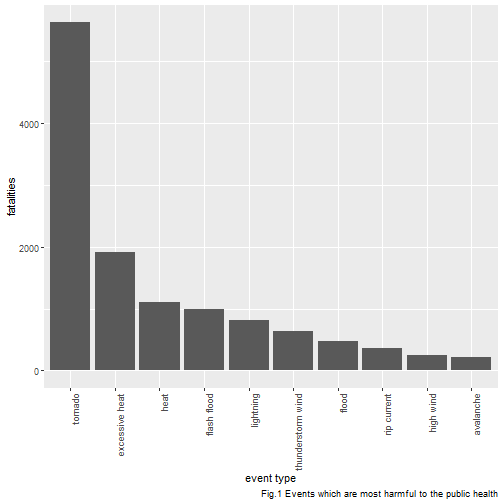
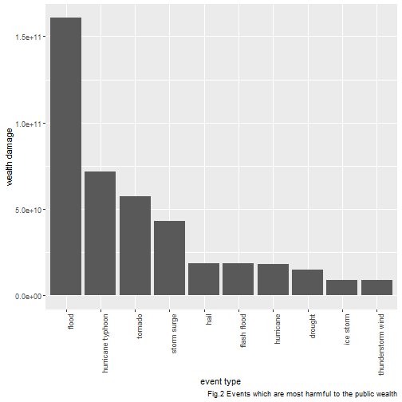

## Ranking the Harmfulness of Severe Weather Events in the U.S.

### Synopsis

In this analysis, two questions are to be answered for the United States. The 
first question is which types of severe weather events are most harmful with 
respect to public health. The other question is which types of severe weather 
events have the greatest economic consequences. The data to be analysed is from 
the U.S. National Oceanic and Atmospheric Administration (NOAA) database and 
contains the events across the United States from 1950 to 2011. As a result of 
the data analysis, it has been hypothesized that tornado, excessive heat, heat 
and flash flood are the most harmful events to the public health. The other 
hypothesis is that flood, hurricane(typhoon), tornado and storm surge are the most 
harmful evens to the public wealth.

### Data Processing

The analysis data can be obtained from the [storm data][1] in the form of a bzip2
file. The preparation of the data is explained in the [storm data documentation][2].
In addition, there is a document of [frequently asked questions][3] about the 
data.

#### Importing the Raw Data

The data is stored in a comma separated file and the missing values are 
represented by blank fields. The storm data is imported. 


```r
if (!file.exists("StormData.csv")){
      the_url <- "https://d396qusza40orc.cloudfront.net/repdata%2Fdata%2FStormData.csv.bz2"
      download.file(the_url, "StormData.csv.bz2")
      the_command <- "bzip2 -d StormData.csv.bz2"
      system(the_command)
}
library(data.table) # load data.table package
library(dplyr) # load dplyr package
# read in data treating "" as NA
data <- fread("StormData.csv", data.table = FALSE, na.strings = "")
# remove duplicate rows in data
data <- distinct(data)
```

#### Processing the Raw Data

After the data is imported, the first few and last few lines of the data are 
displayed.


```r
head(data)
```

```
##   STATE__           BGN_DATE BGN_TIME TIME_ZONE COUNTY COUNTYNAME STATE
## 1       1  4/18/1950 0:00:00     0130       CST     97     MOBILE    AL
## 2       1  4/18/1950 0:00:00     0145       CST      3    BALDWIN    AL
## 3       1  2/20/1951 0:00:00     1600       CST     57    FAYETTE    AL
## 4       1   6/8/1951 0:00:00     0900       CST     89    MADISON    AL
## 5       1 11/15/1951 0:00:00     1500       CST     43    CULLMAN    AL
## 6       1 11/15/1951 0:00:00     2000       CST     77 LAUDERDALE    AL
##    EVTYPE BGN_RANGE BGN_AZI BGN_LOCATI END_DATE END_TIME COUNTY_END
## 1 TORNADO         0    <NA>       <NA>     <NA>     <NA>          0
## 2 TORNADO         0    <NA>       <NA>     <NA>     <NA>          0
## 3 TORNADO         0    <NA>       <NA>     <NA>     <NA>          0
## 4 TORNADO         0    <NA>       <NA>     <NA>     <NA>          0
## 5 TORNADO         0    <NA>       <NA>     <NA>     <NA>          0
## 6 TORNADO         0    <NA>       <NA>     <NA>     <NA>          0
##   COUNTYENDN END_RANGE END_AZI END_LOCATI LENGTH WIDTH F MAG FATALITIES
## 1         NA         0    <NA>       <NA>   14.0   100 3   0          0
## 2         NA         0    <NA>       <NA>    2.0   150 2   0          0
## 3         NA         0    <NA>       <NA>    0.1   123 2   0          0
## 4         NA         0    <NA>       <NA>    0.0   100 2   0          0
## 5         NA         0    <NA>       <NA>    0.0   150 2   0          0
## 6         NA         0    <NA>       <NA>    1.5   177 2   0          0
##   INJURIES PROPDMG PROPDMGEXP CROPDMG CROPDMGEXP  WFO STATEOFFIC ZONENAMES
## 1       15    25.0          K       0       <NA> <NA>       <NA>      <NA>
## 2        0     2.5          K       0       <NA> <NA>       <NA>      <NA>
## 3        2    25.0          K       0       <NA> <NA>       <NA>      <NA>
## 4        2     2.5          K       0       <NA> <NA>       <NA>      <NA>
## 5        2     2.5          K       0       <NA> <NA>       <NA>      <NA>
## 6        6     2.5          K       0       <NA> <NA>       <NA>      <NA>
##   LATITUDE LONGITUDE LATITUDE_E LONGITUDE_ REMARKS REFNUM
## 1     3040      8812       3051       8806    <NA>      1
## 2     3042      8755          0          0    <NA>      2
## 3     3340      8742          0          0    <NA>      3
## 4     3458      8626          0          0    <NA>      4
## 5     3412      8642          0          0    <NA>      5
## 6     3450      8748          0          0    <NA>      6
```

```r
tail(data)
```

```
##        STATE__           BGN_DATE    BGN_TIME TIME_ZONE COUNTY
## 902292      47 11/28/2011 0:00:00 03:00:00 PM       CST     21
## 902293      56 11/30/2011 0:00:00 10:30:00 PM       MST      7
## 902294      30 11/10/2011 0:00:00 02:48:00 PM       MST      9
## 902295       2  11/8/2011 0:00:00 02:58:00 PM       AKS    213
## 902296       2  11/9/2011 0:00:00 10:21:00 AM       AKS    202
## 902297       1 11/28/2011 0:00:00 08:00:00 PM       CST      6
##                                  COUNTYNAME STATE         EVTYPE BGN_RANGE
## 902292 TNZ001>004 - 019>021 - 048>055 - 088    TN WINTER WEATHER         0
## 902293                         WYZ007 - 017    WY      HIGH WIND         0
## 902294                         MTZ009 - 010    MT      HIGH WIND         0
## 902295                               AKZ213    AK      HIGH WIND         0
## 902296                               AKZ202    AK       BLIZZARD         0
## 902297                               ALZ006    AL     HEAVY SNOW         0
##        BGN_AZI BGN_LOCATI           END_DATE    END_TIME COUNTY_END
## 902292    <NA>       <NA> 11/29/2011 0:00:00 12:00:00 PM          0
## 902293    <NA>       <NA> 11/30/2011 0:00:00 10:30:00 PM          0
## 902294    <NA>       <NA> 11/10/2011 0:00:00 02:48:00 PM          0
## 902295    <NA>       <NA>  11/9/2011 0:00:00 01:15:00 PM          0
## 902296    <NA>       <NA>  11/9/2011 0:00:00 05:00:00 PM          0
## 902297    <NA>       <NA> 11/29/2011 0:00:00 04:00:00 AM          0
##        COUNTYENDN END_RANGE END_AZI END_LOCATI LENGTH WIDTH  F MAG
## 902292         NA         0    <NA>       <NA>      0     0 NA   0
## 902293         NA         0    <NA>       <NA>      0     0 NA  66
## 902294         NA         0    <NA>       <NA>      0     0 NA  52
## 902295         NA         0    <NA>       <NA>      0     0 NA  81
## 902296         NA         0    <NA>       <NA>      0     0 NA   0
## 902297         NA         0    <NA>       <NA>      0     0 NA   0
##        FATALITIES INJURIES PROPDMG PROPDMGEXP CROPDMG CROPDMGEXP WFO
## 902292          0        0       0          K       0          K MEG
## 902293          0        0       0          K       0          K RIW
## 902294          0        0       0          K       0          K TFX
## 902295          0        0       0          K       0          K AFG
## 902296          0        0       0          K       0          K AFG
## 902297          0        0       0          K       0          K HUN
##                       STATEOFFIC
## 902292           TENNESSEE, West
## 902293 WYOMING, Central and West
## 902294          MONTANA, Central
## 902295          ALASKA, Northern
## 902296          ALASKA, Northern
## 902297            ALABAMA, North
##                                                                                                                                                            ZONENAMES
## 902292 LAKE - LAKE - OBION - WEAKLEY - HENRY - DYER - GIBSON - CARROLL - LAUDERDALE - TIPTON - HAYWOOD - CROCKETT - MADISON - CHESTER - HENDERSON - DECATUR - SHELBY
## 902293                                                                              OWL CREEK & BRIDGER MOUNTAINS - OWL CREEK & BRIDGER MOUNTAINS - WIND RIVER BASIN
## 902294                                                                                     NORTH ROCKY MOUNTAIN FRONT - NORTH ROCKY MOUNTAIN FRONT - EASTERN GLACIER
## 902295                                                                                                 ST LAWRENCE IS. BERING STRAIT - ST LAWRENCE IS. BERING STRAIT
## 902296                                                                                                                 NORTHERN ARCTIC COAST - NORTHERN ARCTIC COAST
## 902297                                                                                                                                             MADISON - MADISON
##        LATITUDE LONGITUDE LATITUDE_E LONGITUDE_
## 902292        0         0          0          0
## 902293        0         0          0          0
## 902294        0         0          0          0
## 902295        0         0          0          0
## 902296        0         0          0          0
## 902297        0         0          0          0
##                                                                                                                                                                                                                                                                                                                                                                                                                                                                                                                                                                                                                                                                                                                                                                                                                                                                                                                                                                                                                                                                                                                                                                                                                                                                                                                                                                                                                                                                                                                                                                                                                                                                                                                                                                                                                                                                                                                                                                                                                                                                                                        REMARKS
## 902292                                                                                                                                                                                                                                                                                                                                                                                                                                                                                                                                                                                                                                                                                                                                                                                                                                                                                                                                                                                                                                                                                                                                                                                                                                                                                                                                                                                                                                                                                                                                                                                                                                                                                                    EPISODE NARRATIVE: A powerful upper level low pressure system brought snow to portions of Northeast Arkansas, the Missouri Bootheel, West Tennessee and extreme north Mississippi. Most areas picked up between 1 and 3 inches of with areas of Northeast Arkansas and the Missouri Bootheel receiving between 4 and 6 inches of snow.EVENT NARRATIVE: Around 1 inch of snow fell in Carroll County.
## 902293                                                                                                                                                                                                                                                                                                                                                                                                                                                                                                                                                                                                                                                                                                                                                                                                                                                                                                                                                                                                                                                                                                                                                                                                                                                                                                                                                                                                                                                                                                                                                                                                                                                                                                                                                                                                                                           EPISODE NARRATIVE: A strong cold front moved south through north central Wyoming bringing high wind to the Meeteetse area and along the south slopes of the western Owl Creek Range. Wind gusts to 76 mph were recorded at Madden Reservoir.EVENT NARRATIVE: 
## 902294                                                                                                                                                                                                                                                                                                                                                                                                                                                                                                                                                                                                                                                                                                                                                                                                                                                                                                                                                                                                                                                                                                                                                                                                                                                                                                                                                                                                                                                                                                                                                                                                                                                                                                                                                                                      EPISODE NARRATIVE: A strong westerly flow aloft produced gusty winds at the surface along the Rocky Mountain front and over the plains of Central Montana. Wind gusts in excess of 60 mph were reported.EVENT NARRATIVE: A wind gust to 60 mph was reported at East Glacier Park 1ENE (the Two Medicine DOT site).
## 902295 EPISODE NARRATIVE: A 960 mb low over the southern Aleutians at 0300AKST on the 8th intensified to 945 mb near the Gulf of Anadyr by 2100AKST on the 8th. The low crossed the Chukotsk Peninsula as a 956 mb low at 0900AKST on the 9th, and moved into the southern Chukchi Sea as a 958 mb low by 2100AKST on the 9th. The low then tracked to the northwest and weakened to 975 mb about 150 miles north of Wrangel Island by 1500AKST on the 10th. The storm was one of the strongest storms to impact the west coast of Alaska since November 1974. \n\nZone 201: Blizzard conditions were observed at Wainwright from approximately 1153AKST through 1611AKST on the 9th. The visibility was frequently reduced to one quarter mile in snow and blowing snow. There was a peak wind gust to 43kt (50 mph) at the Wainwright ASOS. During this event, there was also a peak wind gust to \n68 kt (78 mph) at the Cape Lisburne AWOS. \n\nZone 202: Blizzard conditions were observed at Barrow from approximately 1021AKST through 1700AKST on the 9th. The visibility was frequently reduced to one quarter mile or less in blowing snow. There was a peak wind gust to 46 kt (53 mph) at the Barrow ASOS. \n\nZone 207: Blizzard conditions were observed at Kivalina from approximately 0400AKST through 1230AKST on the 9th. The visibility was frequently reduced to one quarter of a mile in snow and blowing snow. There was a peak wind gust to 61 kt (70 mph) at the Kivalina ASOS.  The doors to the village transportation shed were blown out to sea.  Many homes lost portions of their tin roofing, and satellite dishes were ripped off of roofs. One home had its door blown off.  At Point Hope, severe blizzard conditions were observed. There was a peak wind gust of 68 kt (78 mph) at the Point Hope AWOS before power was lost to the AWOS. It was estimated that the wind gusted as high as 85 mph in the village during the height of the storm during the morning and early afternoon hours on the 9th. Five power poles were knocked down in the storm EVENT NARRATIVE: 
## 902296 EPISODE NARRATIVE: A 960 mb low over the southern Aleutians at 0300AKST on the 8th intensified to 945 mb near the Gulf of Anadyr by 2100AKST on the 8th. The low crossed the Chukotsk Peninsula as a 956 mb low at 0900AKST on the 9th, and moved into the southern Chukchi Sea as a 958 mb low by 2100AKST on the 9th. The low then tracked to the northwest and weakened to 975 mb about 150 miles north of Wrangel Island by 1500AKST on the 10th. The storm was one of the strongest storms to impact the west coast of Alaska since November 1974. \n\nZone 201: Blizzard conditions were observed at Wainwright from approximately 1153AKST through 1611AKST on the 9th. The visibility was frequently reduced to one quarter mile in snow and blowing snow. There was a peak wind gust to 43kt (50 mph) at the Wainwright ASOS. During this event, there was also a peak wind gust to \n68 kt (78 mph) at the Cape Lisburne AWOS. \n\nZone 202: Blizzard conditions were observed at Barrow from approximately 1021AKST through 1700AKST on the 9th. The visibility was frequently reduced to one quarter mile or less in blowing snow. There was a peak wind gust to 46 kt (53 mph) at the Barrow ASOS. \n\nZone 207: Blizzard conditions were observed at Kivalina from approximately 0400AKST through 1230AKST on the 9th. The visibility was frequently reduced to one quarter of a mile in snow and blowing snow. There was a peak wind gust to 61 kt (70 mph) at the Kivalina ASOS.  The doors to the village transportation shed were blown out to sea.  Many homes lost portions of their tin roofing, and satellite dishes were ripped off of roofs. One home had its door blown off.  At Point Hope, severe blizzard conditions were observed. There was a peak wind gust of 68 kt (78 mph) at the Point Hope AWOS before power was lost to the AWOS. It was estimated that the wind gusted as high as 85 mph in the village during the height of the storm during the morning and early afternoon hours on the 9th. Five power poles were knocked down in the storm EVENT NARRATIVE: 
## 902297                           EPISODE NARRATIVE: An intense upper level low developed on the 28th at the base of a highly amplified upper trough across the Great Lakes and Mississippi Valley.  The upper low closed off over the mid South and tracked northeast across the Tennessee Valley during the morning of the 29th.   A warm conveyor belt of heavy rainfall developed in advance of the low which dumped from around 2 to over 5 inches of rain across the eastern two thirds of north Alabama and middle Tennessee.  The highest rain amounts were recorded in Jackson and DeKalb Counties with 3 to 5 inches.  The rain fell over 24 to 36 hour period, with rainfall remaining light to moderate during most its duration.  The rainfall resulted in minor river flooding along the Little River, Big Wills Creek and Paint Rock.   A landslide occurred on Highway 35 just north of Section in Jackson County.  A driver was trapped in his vehicle, but was rescued unharmed.  Trees, boulders and debris blocked 100 to 250 yards of Highway 35.\n\nThe rain mixed with and changed to snow across north Alabama during the afternoon and  evening hours of the 28th, and lasted into the 29th.  The heaviest bursts of snow occurred in northwest Alabama during the afternoon and evening hours, and in north central and northeast Alabama during the overnight and morning hours.  Since ground temperatures were in the 50s, and air temperatures in valley areas only dropped into the mid 30s, most of the snowfall melted on impact with mostly trace amounts reported in valley locations.  However, above 1500 foot elevation, snow accumulations of 1 to 2 inches were reported.  The heaviest amount was 2.3 inches on Monte Sano Mountain, about 5 miles northeast of Huntsville.EVENT NARRATIVE: Snowfall accumulations of up to 2.3 inches were reported on the higher elevations of eastern Madison County.  A snow accumulation of 1.5 inches was reported 2.7 miles south of Gurley, while 2.3 inches was reported 3 miles east of Huntsville atop Monte Sano Mountain.
##        REFNUM
## 902292 902292
## 902293 902293
## 902294 902294
## 902295 902295
## 902296 902296
## 902297 902297
```

A column of the data contains unusually long entries. It is the REMARKS column 
to the left of the REFNUM column. The columns that are of interest are EVTYPE, 
FATALITIES, INJURIES, PROPDMG, PROPDMGEXP, CROPDMG, CROPDMGEXP. EVTYPE is the 
type of the event. FATALITIES stores the number of the dead people. INJURIES 
gives the number of injured people. PROPDMG is the base part of the property 
damage in terms of dollars. PROPDMGEXP is the exponent part of the property 
damage. CROPDMG and CROPDMGEXP are similar to PROPDMG and PROPDMGEXP with the 
difference that they are for crop damages. The columns that are related with 
the analysis are selected and renamed, the rest are discarded.


```r
data <- select(data, STATE = STATE__, COUNTY, EVTYPE, FATALITIES, INJURIES, 
               PROPDMG, PROPDMGEXP, CROPDMG, CROPDMGEXP)
```

The proportion of NA's is determined.


```r
prop_na <- function(x){round(mean(is.na(x)), 2)}
na_table <- sapply(data, prop_na)
print(na_table)
```

```
##      STATE     COUNTY     EVTYPE FATALITIES   INJURIES    PROPDMG 
##       0.00       0.00       0.00       0.00       0.00       0.00 
## PROPDMGEXP    CROPDMG CROPDMGEXP 
##       0.52       0.00       0.69
```

The unique values for PROPDMGEXP and CROPDMGEXP are as follows:


```r
print(unique(data$PROPDMGEXP))
```

```
##  [1] "K" "M" NA  "B" "m" "+" "0" "5" "6" "?" "4" "2" "3" "h" "7" "H" "-"
## [18] "1" "8"
```

```r
print(unique(data$CROPDMGEXP))
```

```
## [1] NA  "M" "K" "m" "B" "?" "0" "k" "2"
```

In the storm data preparation manual, it is stated that alphabetical characters 
are used to indicate the magnitude of the damage. They are "K" for thousands, "M" 
for millions and "B" for billions. Hence, the characters in the PROPDMGEXP and 
CROPDMGEXP will be interpreted accordingly. If the exponent character is either 
of "K/k" or "M/m" or "B/b", the damage is multiplied by a thousand or a million or 
a billion, respectively. If the exponent character is a digit, then the magnitude 
is multiplied by 10 to the power being equal to the digit. For all the other 
cases, including NA's, the exponent character has no effect. Hence, the proportions 
of the NA's for PROPDMGEXP and CROPDMGEXP are not important. However, this 
transformation is an approximation to the damage because in the REMARKS column, 
there are some entries giving the amount of damage depending on reports of various 
sources. These damage reports in the REMARKS column are neglected. 

The approximate total damage is calculated and added as a new column to the data.


```r
# function to convert exponent characters to numeric characters
exponent <- function(x){
      if (x %in% c("K", "k")){
            x = "3"
      } else if (x %in% c("M", "m")){
            x = "6"
      } else if (x %in% c("B", "b")){
            x = "9"
      } else if (x %in% c("+", "?", "h", "H", "-")){
            x = "0"
      } else if (is.na(x)){
            x = "0"
      } else {
            x = x
      }
      x
}
# convert property exponent characters to numeric characters
data$PROPDMGEXP <- sapply(data$PROPDMGEXP, exponent)
# convert crop exponent characters to numeric characters
data$CROPDMGEXP <- sapply(data$CROPDMGEXP, exponent)
data$PROPDMGEXP <- as.numeric(data$PROPDMGEXP)
data$CROPDMGEXP <- as.numeric(data$CROPDMGEXP)
data <- data %>%
      # compute the property damage and crop damage
      mutate(PROPDMG = PROPDMG * (10 ^ PROPDMGEXP), 
             CROPDMG = CROPDMG * (10 ^ CROPDMGEXP)) %>%
      # discard PROPDMGEXP and CROPDMGEXP columns
      select(STATE, COUNTY, EVTYPE, FATALITIES, INJURIES, 
             PROPDMG, CROPDMG) %>%
      as.data.frame()
# remove extra blanks in the event type names
data$EVTYPE <- trimws(data$EVTYPE)
# convert event type names to lower case
data$EVTYPE <- tolower(data$EVTYPE)
# get the distinct event type names
data_ev_types <- unique(data$EVTYPE)
```

Let the number of unique event types be determined.


```r
num_event_types <- length(data_ev_types)
```

The number of distinct event types is 890. That is a huge number. 
Let the event types given in the storm manual be checked. They are as follows:


```r
default_event_types <- c("Astronomical Low Tide", "Avalanche", "Blizzard", 
                         "Coastal Flood", "Cold/Wind Chill", "Debris Flow",
                         "Dense Fog", "Dense Smoke", "Drought", "Dust Devil",
                         "Dust Storm", "Excessive Heat", "Extreme Cold/Wind Chill",
                         "Flash Flood", "Flood", "Frost/Freeze", "Funnel Cloud",
                         "Freezing Fog", "Hail", "Heat", "Heavy Rain", "Heavy Snow",
                         "High Surf", "High Wind", "Hurricane (Typhoon)", "Ice Storm",
                         "Lake-Effect Snow", "Lakeshore Flood", "Lightning", 
                         "Marine Hail", "Marine High Wind", "Marine Strong Wind",
                         "Marine Thunderstorm Wind", "Rip Current", "Seiche", 
                         "Sleet", "Storm Surge/Tide", "Strong Wind", 
                         "Thunderstorm Wind", "Tornado", "Tropical Depression",
                         "Tropical Storm", "Tsunami", "Volcanic Ash", "Waterspout",
                         "Wildfire", "Winter Storm", "Winter Weather")
print(default_event_types)
```

```
##  [1] "Astronomical Low Tide"    "Avalanche"               
##  [3] "Blizzard"                 "Coastal Flood"           
##  [5] "Cold/Wind Chill"          "Debris Flow"             
##  [7] "Dense Fog"                "Dense Smoke"             
##  [9] "Drought"                  "Dust Devil"              
## [11] "Dust Storm"               "Excessive Heat"          
## [13] "Extreme Cold/Wind Chill"  "Flash Flood"             
## [15] "Flood"                    "Frost/Freeze"            
## [17] "Funnel Cloud"             "Freezing Fog"            
## [19] "Hail"                     "Heat"                    
## [21] "Heavy Rain"               "Heavy Snow"              
## [23] "High Surf"                "High Wind"               
## [25] "Hurricane (Typhoon)"      "Ice Storm"               
## [27] "Lake-Effect Snow"         "Lakeshore Flood"         
## [29] "Lightning"                "Marine Hail"             
## [31] "Marine High Wind"         "Marine Strong Wind"      
## [33] "Marine Thunderstorm Wind" "Rip Current"             
## [35] "Seiche"                   "Sleet"                   
## [37] "Storm Surge/Tide"         "Strong Wind"             
## [39] "Thunderstorm Wind"        "Tornado"                 
## [41] "Tropical Depression"      "Tropical Storm"          
## [43] "Tsunami"                  "Volcanic Ash"            
## [45] "Waterspout"               "Wildfire"                
## [47] "Winter Storm"             "Winter Weather"
```
There are 48 default event types. The number of event
types in the data set is 890. They are very different from each 
other. This difference indicates that there are event type names in the data set 
which are different from the default event type names. Hence, the ranking of the 
event types will be made according to two data sets. First data set is the original 
data set. The second data set will be obtained from the original one by processing 
the event type names in such a way that they are similar to the default event 
type names. Let the default event types and the event types in the data set be 
matched.


```r
# default event types are converted to lower case
default_event_types <- tolower(default_event_types)
# "/" character and extra blanks are removed from the default event type names
default_event_types_trimmed <- trimws(gsub("/", " ", default_event_types))
# default event type names are splitted and combined to form the set of default
# type keywords
default_keywords <- unique(unlist(strsplit(default_event_types_trimmed, " ",
                                           fixed = TRUE)))
# "(" character is removed from the default keywords
default_keywords <- gsub("\\(", "", default_keywords)
# ")" character is removed from the default keywords
default_keywords <- gsub("\\)", "", default_keywords)

# clone the original data set
data_modif <- data

# remove the "/" character from the event type names
data_modif$EVTYPE <- gsub("/", " ", data_modif$EVTYPE)
# convert "tstm" to thunderstorm in the event type names
data_modif$EVTYPE <- gsub("tstm", "thunderstorm", data_modif$EVTYPE)
# remove the extra blank spaces in the event type names
data_modif$EVTYPE <- trimws(data_modif$EVTYPE)

# split the event type names into words
splitted_names <- strsplit(data_modif$EVTYPE, " ")

# take the intersection of the splitted names with the default keywords to 
# obtain a name more similar to the default type name
edit_type <- function(x){
      paste(dplyr::intersect(x, default_keywords), collapse = " ")
}

# obtain the names similar to the default event type names
similar_names <- sapply(splitted_names, edit_type)
# update the event type names
data_modif$EVTYPE <- similar_names
```

The processing of the raw data has been completed.

### Results

The processed data is to be analysed to determine which types of severe weather 
events are most harmful with respect to public health and which types of severe 
weather events have the greatest economic consequences. The analyses will be 
performed for the original data set and the data set with the modified event type 
names.

#### Damage to the Public Health

The effect of the events to the public health is to be determined first. The total 
number of deaths and injuries will be found and the events will be ordered with 
respect to death first and injuries second.


```r
# using the original data set, total fatalities and injuries are computed and 
# data is ordered with respect to decreasing fatalities and injuries
health <- data %>% group_by(EVTYPE) %>% 
      summarise(fatalities = sum(FATALITIES), injuries = sum(INJURIES)) %>%
      arrange(desc(fatalities), desc(injuries)) %>%
      as.data.frame()
head(health, n = 10)
```

```
##            EVTYPE fatalities injuries
## 1         tornado       5633    91346
## 2  excessive heat       1903     6525
## 3     flash flood        978     1777
## 4            heat        937     2100
## 5       lightning        816     5230
## 6       tstm wind        504     6957
## 7           flood        470     6789
## 8     rip current        368      232
## 9       high wind        248     1137
## 10      avalanche        224      170
```

The data set with the modified event names is also processed to determine the 
events which are most harmful to the public health.


```r
# using the modified data set, total fatalities and injuries are computed and 
# data is ordered with respect to decreasing fatalities and injuries
health <- data_modif %>% group_by(EVTYPE) %>% 
      summarise(fatalities = sum(FATALITIES), injuries = sum(INJURIES)) %>%
      arrange(desc(fatalities), desc(injuries)) %>%
      as.data.frame()
head(health, n = 10)
```

```
##               EVTYPE fatalities injuries
## 1            tornado       5633    91364
## 2     excessive heat       1920     6525
## 3               heat       1116     2529
## 4        flash flood        997     1777
## 5          lightning        816     5231
## 6  thunderstorm wind        640     8450
## 7              flood        473     6791
## 8        rip current        368      232
## 9          high wind        255     1158
## 10         avalanche        224      170
```

From these two results, it is hypothesized that tornado, excessive heat, heat 
and flash flood are the most harmful events to the public health although the 
orders of the heat and flash flood are interchanged in the original data set and 
the modified data set.

The events most harmful to the public health are plotted.


```r
library(ggplot2) # load the package ggplot2
health <- health[1:10, ] # first ten rows are selected
# order the bars with respect to decreasing fatalities 
p <- ggplot(health, aes(x = reorder(EVTYPE, -fatalities), y = fatalities))
p <- p + geom_bar(stat = "identity")
x_label <- "event type" # x axis label
the_caption <- "Fig.1 Events which are most harmful to the public health"
p <- p + labs(x = x_label, caption = the_caption)
# x axis tick labels are made vertical due to space restrictions
p <- p + theme(axis.text.x = element_text(angle = 90, hjust = 1))
p
```



#### Damage to the Public Wealth

The damage of the events to the public wealth is to be examined. The total 
expense of the property and the crop damages will be computed and arranged in a 
decresing order.


```r
# using the original data set, total wealth damage is computed and 
# data is ordered with respect to decreasing wealth damage
wealth <- data %>% group_by(EVTYPE) %>% 
      summarise(wealth_damage = sum(PROPDMG) + sum(CROPDMG)) %>%
      arrange(desc(wealth_damage)) %>%
      as.data.frame()
head(wealth, n = 10)
```

```
##               EVTYPE wealth_damage
## 1              flood  150319678257
## 2  hurricane/typhoon   71913712800
## 3            tornado   57362333947
## 4        storm surge   43323541000
## 5               hail   18761221491
## 6        flash flood   18244041079
## 7            drought   15018672000
## 8          hurricane   14610229010
## 9        river flood   10148404500
## 10         ice storm    8967041360
```

The same examination is to be carried out for the data set with the modified 
event type names.


```r
# using the modified data set, total wealth damage is computed and 
# data is ordered with respect to decreasing wealth damage
wealth <- data_modif %>% group_by(EVTYPE) %>% 
      summarise(wealth_damage = sum(PROPDMG) + sum(CROPDMG)) %>%
      arrange(desc(wealth_damage)) %>%
      as.data.frame()
head(wealth, n = 10)
```

```
##               EVTYPE wealth_damage
## 1              flood  160610286507
## 2  hurricane typhoon   71913712800
## 3            tornado   57367112347
## 4        storm surge   43323541000
## 5               hail   18783426541
## 6        flash flood   18519524085
## 7          hurricane   18247685010
## 8            drought   15018672000
## 9          ice storm    8967041360
## 10 thunderstorm wind    8945660869
```

From these two results, it is hypothesized that flood, hurricane(typhoon), 
tornado and storm surge are the most harmful evens to the public wealth.

The events most harmful to the public wealth are plotted.


```r
wealth <- wealth[1:10, ] # first ten rows are selected
# order the bars with respect to decreasing wealth damage
p <- ggplot(wealth, aes(x = reorder(EVTYPE, -wealth_damage), y = wealth_damage))
p <- p + geom_bar(stat = "identity")
x_label <- "event type" # x axis label
y_label <- "wealth damage" # y axis label
the_caption <- "Fig.2 Events which are most harmful to the public wealth"
p <- p + labs(x = x_label, y = y_label, caption = the_caption)
# x axis tick labels are made vertical due to space restrictions
p <- p + theme(axis.text.x = element_text(angle = 90, hjust = 1))
p
```



[1]: https://d396qusza40orc.cloudfront.net/repdata%2Fdata%2FStormData.csv.bz2 "storm data"
[2]: https://d396qusza40orc.cloudfront.net/repdata%2Fpeer2_doc%2Fpd01016005curr.pdf "storm data documentation"
[3]: https://d396qusza40orc.cloudfront.net/repdata%2Fpeer2_doc%2FNCDC%20Storm%20Events-FAQ%20Page.pdf "frequently asked questions"
